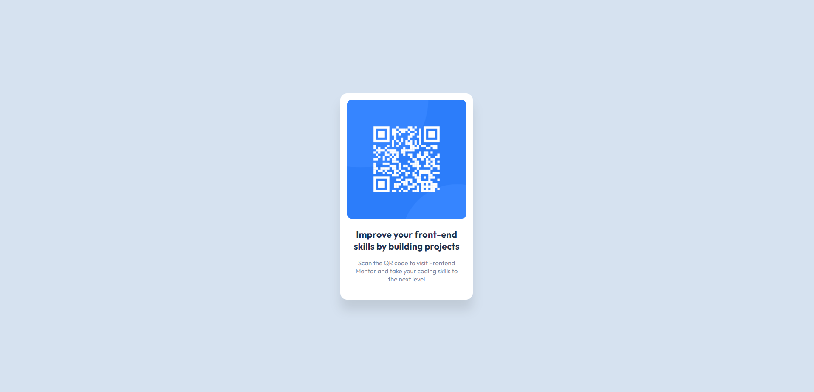

# Frontend Mentor - QR code component solution

This is a solution to the [QR code component challenge on Frontend Mentor](https://www.frontendmentor.io/challenges/qr-code-component-iux_sIO_H). Frontend Mentor challenges help you improve your coding skills by building realistic projects. 

## Overview

### Screenshot

### Links

- Solution URL: [Solution Repository](https://github.com/lucas-r-moura/qr-code-frontend-mentor)
- Live Site URL: [Live Site](https://lucas-r-moura.github.io/qr-code-frontend-mentor/)

## My process

### Built with

- Semantic HTML5 markup
- CSS custom properties
- Flexbox

## Author

<!-- - Website - [Add your name here](https://www.your-site.com) -->
- Frontend Mentor - [@lucas-r-moura](https://www.frontendmentor.io/profile/lucas-r-moura)
- Linkedin - [Lucas Moura](https://www.linkedin.com/in/lucas-r-moura/)

